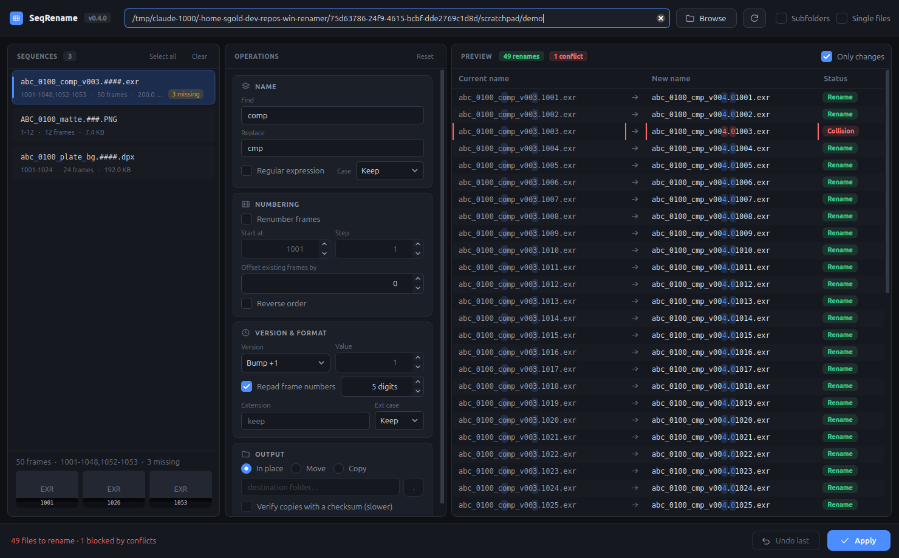

# SeqRename

A safe, previewable renamer for VFX image sequences (EXR, DPX, TIFF, PNG, …),
built to the spec in [`prd.md`](prd.md). Pure-stdlib engine plus a PySide6
desktop app for Windows 11.



## What it does

Scans a folder, groups files into sequences, and previews every rename before
anything touches disk.

- **Operations:** find/replace (literal or regex), case, version set/bump/strip,
  renumber (start, step, reverse) or offset, repad, extension swap, and
  rename / move / copy.
- **Nothing is written until you press Apply.** The preview highlights the
  changed characters per file and flags collisions and duplicate targets.
- **Safe by construction:** cycle-safe two-phase renames, rollback on any
  mid-commit failure, a JSON undo journal, pre-commit checks for locked files,
  and copy → verify → delete across volumes.

Shortcuts: `Ctrl+O` browse · `F5` rescan · `Ctrl+Enter` apply · `Ctrl+Z` undo.

## Download

Prebuilt Windows installer, no Python or build step needed:

**[releases/SeqRename-0.3.0-setup.exe](releases/SeqRename-0.3.0-setup.exe)** - 32 MB

```
sha256  b399ef1858932195e05cf3cc17db030a5b8d48aeb9571fd435b0279c58cc33b0
```

Double-click it. It installs for the current user only, so there is no UAC
prompt and no administrator rights are needed - see
[Installing on another machine](#installing-on-another-machine).

## Run it

**Windows** (the target platform):

```powershell
.\build.bat                 # tests + package -> dist\SeqRename\SeqRename.exe
.\build.bat -SkipTests -Run # fast rebuild and launch
.\build.bat -KillRunning    # close a running SeqRename.exe first
.\run-dev.ps1               # run from source instead, no packaging
```

### Installing on another machine

```powershell
.\build.bat -Installer      # -> dist\SeqRename-<version>-setup.exe
```

Copy the setup .exe to the target workstation and run it. It is a per-user
install built with Inno Setup (`PrivilegesRequired=lowest`): files go to
`%LOCALAPPDATA%\Programs\SeqRename`, the Start Menu shortcut and the uninstall
entry are written under HKCU, and nothing touches Program Files, HKLM, the PATH
or any service. No administrator rights, no UAC prompt - which is what makes it
work on a locked-down networked workstation. Uninstall from Apps & features.

Silent install, for deployment across several machines:

```powershell
SeqRename-0.3.0-setup.exe /VERYSILENT /SUPPRESSMSGBOXES /NORESTART
SeqRename-0.3.0-setup.exe /VERYSILENT /DIR="D:\Tools\SeqRename"
SeqRename-0.3.0-setup.exe /ALLUSERS          # machine-wide; this one needs admin
```

Compiling the installer needs [Inno Setup 6](https://jrsoftware.org/isdl.php) on
the build machine. It installs per-user too, so it needs no admin either:

```powershell
innosetup-6.x.x.exe /VERYSILENT /CURRENTUSER /DIR="%LOCALAPPDATA%\Programs\Inno Setup 6"
```

`build.bat` wraps `build.ps1`, which takes the same flags plus `-Clean`. The
build refuses to run while `SeqRename.exe` is open (a running copy holds its
DLLs), and after packaging it launches the exe with `--selftest` and fails if it
does not exit cleanly.

**Linux** (development):

```bash
python -m venv .venv && .venv/bin/pip install PySide6 pytest
PYTHONPATH=src .venv/bin/python -m seqrename.gui
PYTHONPATH=src .venv/bin/python -m pytest tests -q
```

## Syncing Linux → Windows

The repo lives on a Linux partition; builds happen on the Windows side.

```bash
./sync-to-windows.sh            # mirror to C:\Users\USERNAME\Documents\win_dev\seqrename
./sync-to-windows.sh --dry-run  # preview the file list
./sync-to-windows.sh --build    # sync, then build over there
WIN_USER=someone ./sync-to-windows.sh
DEST=/mnt/c/elsewhere ./sync-to-windows.sh
```

`USERNAME` is your Windows account name, looked up automatically; override it
with `WIN_USER`, or give a full path with `DEST`.

The Windows-side `.venv/`, `build/` and `dist/` are excluded, so repeated syncs
never wipe the environment.

## Library use

The engine has no dependency on Qt:

```python
from seqrename import Plan, RenameOps, scan, last_undoable, undo

seqs = scan("D:/renders", recursive=True)
plan = Plan(seqs, RenameOps(find="v001", replace="v002", repad=True, pad=5))
for entry in plan.preview():
    print(entry.src.name, "->", entry.dst.name, entry.status.value)

plan.commit()                    # refuses to run if anything collides
undo(last_undoable("D:/renders"))
```

## Layout

```
src/seqrename/       scanner, ops, plan, fsops, journal   (stdlib only)
src/seqrename/gui/   PySide6 app: window, theme, panels, workers
tests/               pytest suite (engine + headless GUI)
packaging/           PyInstaller spec, icon and version-resource generators
```

Version lives in `src/seqrename/__init__.py` and flows to the package metadata,
the app header badge and the Windows file-version resource. See
[`CHANGELOG.md`](CHANGELOG.md) for what is in this release and what from the PRD
is still unimplemented.
